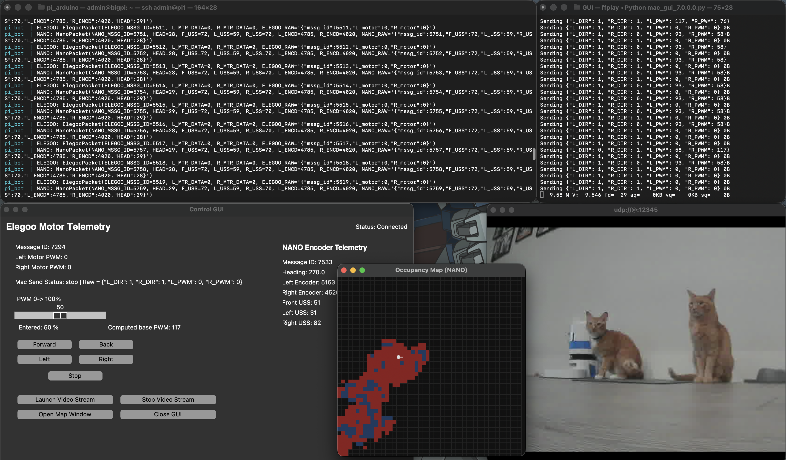

# Pi–Arduino Robot Car
*A Pi Aurduino Robot that navigates, maps, and streams video.*

This project implements a small robot car built on the **ELEGOO Smart Robot Car Kit V4.0**, integrating a **Raspberry Pi** and **two Arduino microcontrollers**.

   
  <i> P.A.R.C </i>

## Architecture  

   
  <i> Connectivity Diagram </i>

### Arduino's
- Code is written in Arduino coding format with standard libraries and some custom header files to clean up main loop. During integrating and building process, there are a series of **test_scripts** to load onto test Arduino's to test the Pi scripts without needing all sensors.
- **Elegoo Uno** Reads JSON input from Pi and sends PWM values to the 4 motors. The Elegoo Motor Shield actually only has 2 inputs for 4 motors (left and right). The motor PWM is then reported back to the Pi in a JSON format.
- **Nano** Continously reads the sensor data from the ultrasonic sensors, rear wheel encoders, and magnemeter and then sends it in a JSON format over serial to the Pi.

### Raspberry Pi
- Raspberry Pi OS
- Edxecutes a python scripts to control and monitor motor and sensor hardware and report telemetry to the laptop.
- Basic obstacle avoidance by constantly checking ultrasonic distance then commanding motors a direction opposite of detected object
- Streams USB camera over unicast TCP to control laptop. Multicast will be used if more than 1 client in the future subscribes.
- udev rules set for each Arduino so that every time container or Pi is rebooted, consistent port mapping
- 2.0 improvements include testability of python code locally with test scripts and gui before loading on hardware

### Control Laptop
- Runs a Tkinter GUI to send commands, monitor telemetry, and draws a block occupancy map of where robot has been.
- 2.0 Improvement utilizes Qt5 and code cleanup.

   
  <i> Running GUI</i>

## Repository Structure
v2_0/
  scripts

v1_0/
  elegoo_project/  
  -- Motor_Sensor_Control/  
  ---- main_elegoo_cpp6/  
  ---- main_nano_cpp5/  
  ---- magnometer_setup  

  -- Pi_Bot_Control/  
  ---- (Pi Files)  

  -- Control_GUI/  
  ---- mac_gui_X.X.py  

  -- Arduino_Test_Scripts/  
  ---- elegoo_test/  
  ---- nano_test/  

## Hardware Requirements
1 x Raspberry Pi 4  
1 x Arduino Nano  
3 x Ultrasonic sensors  
2 x Optical Encoders  
1 x Magnometer  
1 x PiPower3 Battery Module. 
1 x USB Camera. 
2 x USB A - B  
22 x jumpers  
1 x ELEGOO Smart Robot Car Kit V4.0 kit  
-- Only using the following from the kit:  
    4 x DC motors  
    1 x Chassis Set  
    1 x Elegoo Motor Shield  
    1 x Elegoo Uno Battery  
